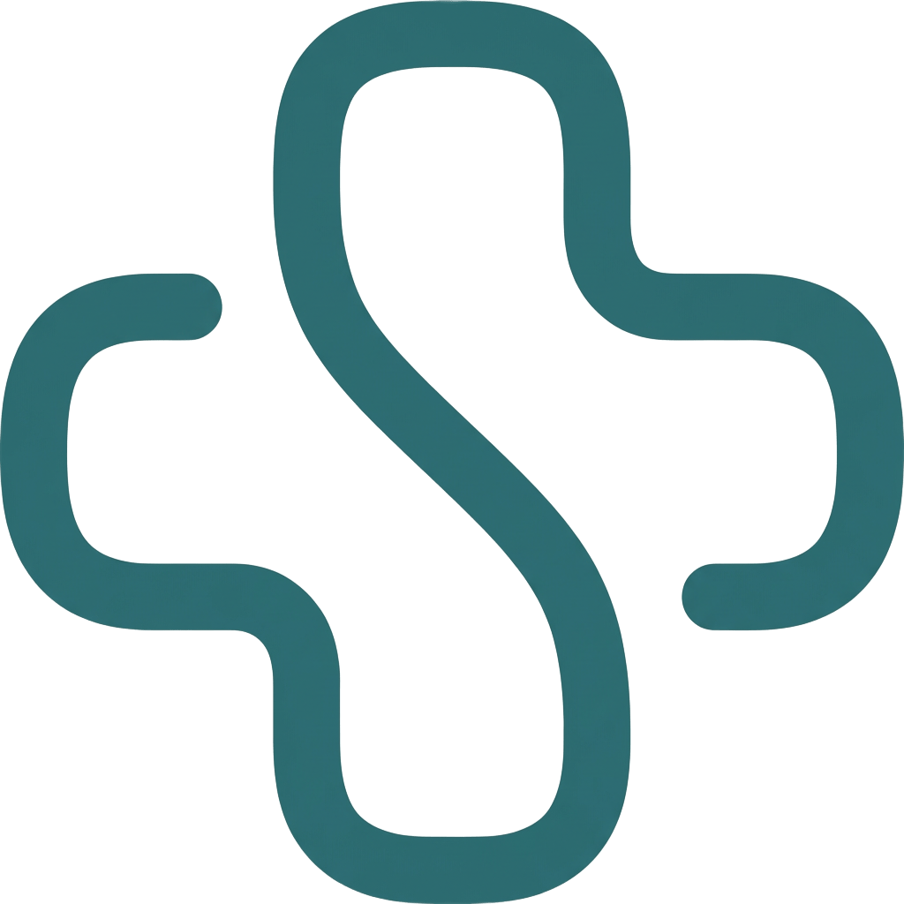
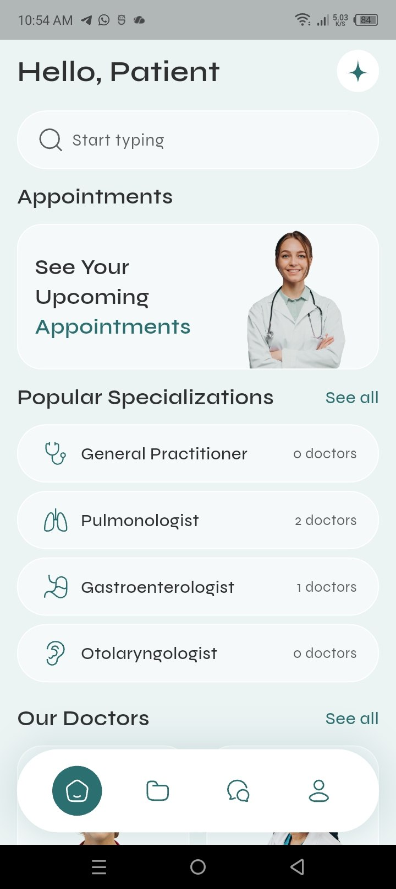
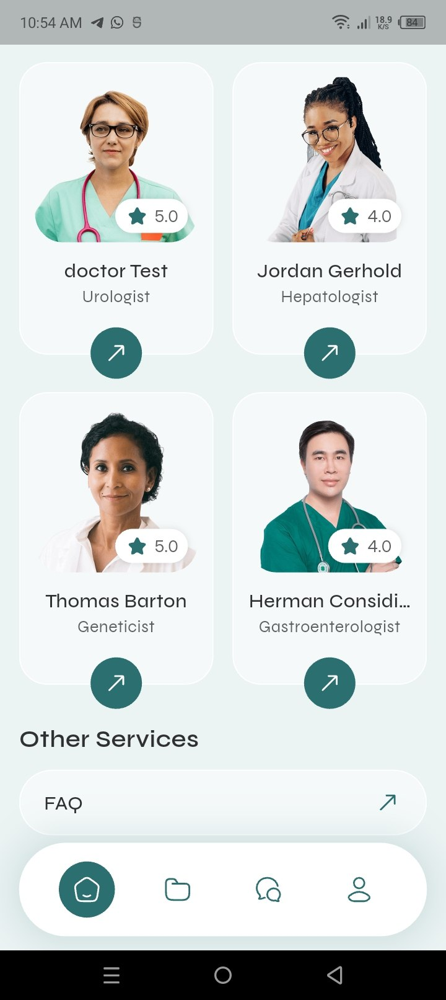
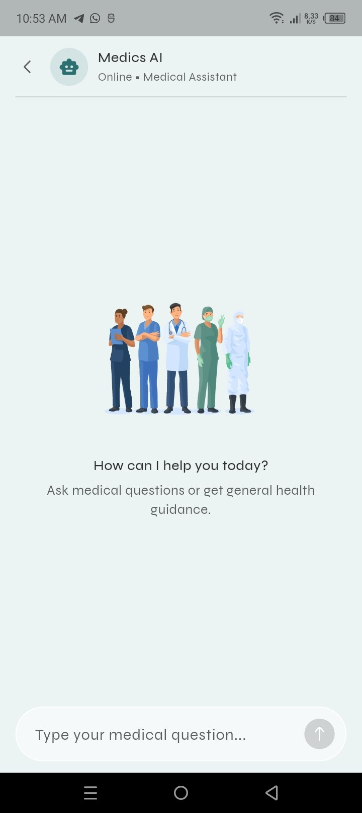
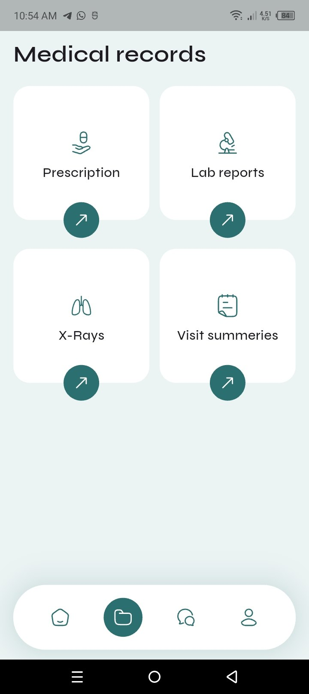
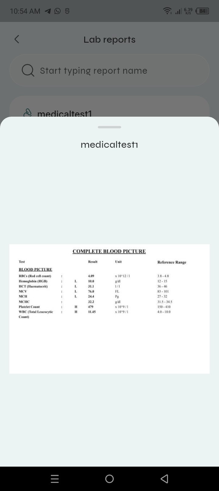
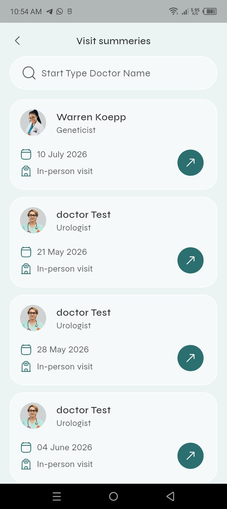

# Medics

<p align="center">
	
</p>

<h3 align="center">Healthcare management, thoughtfully brought together.</h3>

<p align="center">
	A Flutter mobile application that helps patients discover doctors, manage appointments, organize medical records, and stay connected with their care journey.
</p>

<p align="center">
	<a href="https://github.com/ZainAlabdeen17">Zain Alabdeen</a>
	&nbsp;&middot;&nbsp;
	<a href="https://github.com/MohammedHejazi1">Mohammed Hejazi</a>
</p>

<p align="center">
	
	
	
	
</p>

> **Project status:** Final university project. The mobile application is not currently published on an app store. Some flows require the project's private backend to be running locally.

## Overview

Medics is an all-in-one digital healthcare companion designed around the everyday needs of patients. It brings doctor discovery, appointment booking, medical information, conversations, and wallet management into one focused mobile experience.

The application is built as a real client application rather than a static interface: authenticated user flows, remote data access, local persistence, notifications, and realtime communication are wired into the product experience.

## Core capabilities

- **Account and onboarding:** guided onboarding, registration, login, email verification, password recovery, and validation.
- **Patient profile:** personal information, emergency contact, blood type, allergies, chronic conditions, lifestyle information, and health metrics.
- **Doctor discovery:** browse doctors and specializations, search by name, and inspect doctor profiles, qualifications, workplace, and reviews.
- **Appointments:** book, view, cancel, reschedule, and review appointment details and invoices.
- **Medical records:** organize prescriptions, symptoms, diagnoses, lab reports, X-rays, visit summaries, and health metrics.
- **Conversations:** communicate through the in-app messaging experience with realtime updates.
- **Wallet:** view wallet balance, browse available packages, and manage wallet charging flows.
- **Notifications:** receive local appointment and application notifications.
- **Support screens:** FAQ and About Us views for accessible product information.

## Product showcase

The screenshots below are captured from the application and are stored in [`docs/screenshots`](docs/screenshots). Click any screen to open the full-size image.

<table align="center">
	<tr>
		<td align="center" width="210">
			<a href="docs/screenshots/photo_1_2026-08-20_15-35-40.jpg">
				
			</a><br />
			<sub><strong>Home</strong><br />Appointments and specializations</sub>
		</td>
		<td align="center" width="210">
			<a href="docs/screenshots/photo_2_2026-08-20_15-35-40.jpg">
				
			</a><br />
			<sub><strong>Doctors</strong><br />Browse specialists and ratings</sub>
		</td>
		<td align="center" width="210">
			<a href="docs/screenshots/photo_4_2026-08-20_15-35-40.jpg">
				
			</a><br />
			<sub><strong>Medics AI</strong><br />General health guidance</sub>
		</td>
	</tr>
	<tr>
		<td align="center" width="210">
			<a href="docs/screenshots/photo_5_2026-08-20_15-35-40.jpg">
				
			</a><br />
			<sub><strong>Medical records</strong><br />Prescriptions and lab reports</sub>
		</td>
		<td align="center" width="210">
			<a href="docs/screenshots/photo_7_2026-08-20_15-35-40.jpg">
				
			</a><br />
			<sub><strong>Lab reports</strong><br />Review detailed test results</sub>
		</td>
		<td align="center" width="210">
			<a href="docs/screenshots/photo_8_2026-08-20_15-35-40.jpg">
				
			</a><br />
			<sub><strong>Visit summaries</strong><br />Keep track of past visits</sub>
		</td>
	</tr>
</table>

## Technology

| Area                   | Tools                                           |
| ---------------------- | ----------------------------------------------- |
| Mobile framework       | Flutter and Dart                                |
| State management       | `flutter_bloc` / Cubit                          |
| Navigation             | `go_router`                                     |
| Networking             | `dio` with retry support and request logging    |
| Dependency injection   | `get_it`                                        |
| Realtime communication | Pusher channels                                 |
| Local data             | SharedPreferences and path provider             |
| UI and media           | ScreenUtil, SVG, Lottie, shimmer loading states |
| Notifications          | Flutter Local Notifications                     |

## Architecture

The codebase follows a feature-first structure with shared application services under `lib/core`:

```text
lib/
├── core/
│   ├── api/              # HTTP client and API response handling
│   ├── database/         # Local cache and persistence helpers
│   ├── routes/           # Application navigation
│   ├── services/         # Notifications, realtime, and service locator
│   ├── utils/            # Constants, colors, strings, and generated assets
│   └── widgets/          # Shared UI components
└── features/
		├── appointments/
		├── auth/
		├── chat/ and conversation/
		├── doctor/
		├── home/
		├── medical_records/
		├── payments/
		├── patient_card/
		└── profile/
```

Each major feature is separated into data, presentation, models, repositories, and state-management responsibilities where applicable. This keeps user-facing flows easier to evolve as the backend grows.

## Getting started

### Prerequisites

- Flutter SDK compatible with the project environment.
- Dart SDK `3.9.2` or later.
- Android Studio or another configured Flutter development environment.
- A running Medics backend with valid local network access.

### Installation

```bash
git clone https://github.com/ZainAlabdeen17/medics.git
cd medics
flutter pub get
```

### Backend configuration

The current client reads its API host from [`lib/core/utils/app_constant.dart`](lib/core/utils/app_constant.dart). The default value points to a local development server at `192.168.1.100:8000`.

Before running the app, update that local address if your backend uses another host or port, then make sure the backend is reachable from the test device or emulator. The backend repository is private at the moment and is therefore intentionally not linked here.

Do not commit passwords, access tokens, private backend URLs, or real patient information to this repository.

### Run

```bash
flutter run
```

### Quality checks

```bash
flutter analyze
flutter test
```

## Privacy and responsible use

Medics is an educational university project and is not a replacement for professional medical advice, diagnosis, or treatment. Do not use real patient data while testing or demonstrating the application. Any production deployment would require a security review, authenticated API configuration, privacy controls, and appropriate healthcare compliance measures.

## Authors

<p align="center">
	<a href="https://github.com/ZainAlabdeen17">
		
	</a>
	<a href="https://github.com/MohammedHejazi1">
		
	</a>
</p>

<p align="center">
	<strong>Built by two developers who care about making healthcare easier to navigate.</strong>
</p>

<table align="center">
	<tr>
		<td align="center" width="280">
			<a href="https://github.com/ZainAlabdeen17"><strong>Zain Alabdeen</strong></a><br />
			<a href="https://github.com/ZainAlabdeen17">
				
			</a><br />
			<a href="mailto:zyn68640@gmail.com">
				
			</a>
		</td>
		<td align="center" width="280">
			<a href="https://github.com/MohammedHejazi1"><strong>Mohammed Hejazi</strong></a><br />
			<a href="https://github.com/MohammedHejazi1">
				
			</a><br />
			<a href="mailto:mohammedhejazipro@gmail.com">
				
			</a>
		</td>
	</tr>
</table>

<p align="center">
	<sub>Click either profile image or badge to visit the corresponding GitHub account.</sub>
</p>

## License

This project is licensed under the MIT License. See [`LICENSE`](LICENSE) for details.
